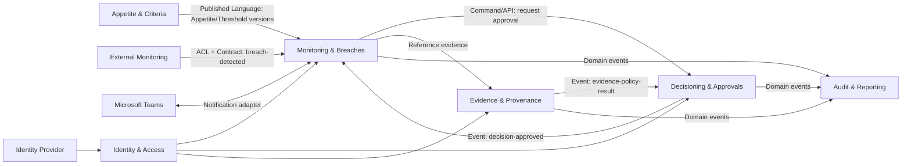

# Context Map

This document defines the relationships and dependencies between the bounded contexts of the ERM platform.

## Relationship Diagram

## Relationship Types

| Relationship | Type | Rationale |
| :--- | :--- | :--- |
| **Appetite -> Monitoring** | Published Language | Shared definitions for thresholds used across multiple contexts. |
| **Monitoring -> Decisioning** | Customer/Supplier | Monitoring depends on Decisioning to fulfill the "Action Response" part of the lifecycle. |
| **External -> Monitoring** | Anti-Corruption Layer (ACL) | Protects the core domain from external monitoring tool schema changes. |
| **Audit -> All** | Customer/Supplier | All domains act as suppliers of events to the Audit context. |
| **Identity -> All** | Conformist | Most domains conform to the standard identity/tenancy model provided by the platform. |
