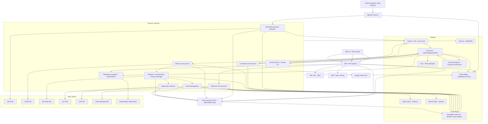

https://chatgpt.com/g/g-p-690f4fa69d048191b96419a6fa21d39f-erm-platform-and-product/c/698c585e-e064-838d-8987-88873b1eb7a5

## Below is an ideal, latest-best-practice “Reference Architecture” for SB-01 (Appetite Breach Response), expressed as a C4-ish container reference architecture (domain + platform primitives) that directly maps to your blueprint steps, controls, and evidence/audit requirements.

### SB-01 Reference Architecture (Industry Standard)
#### 1) Container view (runtime topology)

#### Why this is “industry standard”
This adds the **minimum modern control-plane and correctness** for an audit-grade workflow:
- **Process manager/orchestrator** explicitly exists (your blueprint depends on SLAs, escalations, and handoffs).
- **Outbox/CDC + schema registry + DLQ** are explicit (event-driven correctness).
- **Policy enforcement** at gateway + services, with policy decision logging.
- **Immutable audit log and evidence store** are first-class and linked to workflow correlation IDs.

#### 2) Mapping SB-01 steps to runtime components

**Step 1 — Alert received; ingestion validates freshness/integrity**
- **Ingestion Service**: validates freshness gate + integrity checks (hash/shape/schema)
- **Monitoring & Breach Detection**: creates alert
- Emits: alert_created (domain event) + audit.alert_created (audit event)

**Step 2 — Triage + correlation + enrichment (CMDB/service-map)**
- **Correlation & Enrichment**: groups alerts, enriches with service_asset_link
- Optional connectors: CMDB/service map adapter (behind COR)
- Emits: alert_correlated, enrichment_applied

**Step 3 — Breach confirmed; breach case created; workflow starts SLAs**
- **Breach Case Service**: SoR for breach_case lifecycle
- **AI Risk Service**: Generates zero-shot assessment suggestions (Gemini 2.0)
- **Workflow/Orchestration**: SoR for process state (routing, timers, escalations, “pending links” states)
- Emits: breach_confirmed, breach_case_opened, ai_suggestion_created, sla_timer_started

**Step 4 — Mitigation actions launched; reminders**
- **Action Management**: SoR for mitigation_action
- Orchestrator schedules reminders/SLAs; pushes tasks/notifications via adapter
- Emits: mitigation_launched, action_assigned, reminder_sent

**Step 5 — Escalate beyond tolerance; approvals/waiver exception**
- **Approvals & Waivers**: SoR for approval, waiver_exception (with expiry)
- Orchestrator routes to authority (ExCo/Board) based on rule version
- Emits: breach_escalated, waiver_requested, waiver_approved/denied, acceptance_recorded

**Step 6 — Verify mitigation and close; post-review prompts**
- **Evidence & Provenance**: stores verification evidence + integrity hash, provenance
- **Repor   ting/Analytics**: projections and recurrence prompts (read model)
- Emits: mitigation_verified, breach_case_resolved, post_review_created

#### 3) Domain boundaries and “system of record” rules

**Industry best practice is to make SoR explicit (prevents the “shared database / cross-schema join” trap):**

- **Monitoring & Breach Detection**: SoR for alert, indicator_evaluation
- **Correlation & Enrichment**: SoR for correlation_group, enrichment_snapshot
- **Breach Case**: SoR for breach_case, breach_log, state transitions
- **Workflow/Orchestration**: SoR for process state, timers, routing decisions, SLA status
- **Action Management**: SoR for mitigation_action
- **Approvals & Waivers**: SoR for approval, waiver_exception, delegated authority decisions
- **Evidence & Provenance**: SoR for evidence_item metadata + integrity/provenance; object store for binaries
- **Reporting/Analytics**: SoR for read models only (projections), not “truth”

**Rule: No cross-context queries at runtime. Cross-context read needs projections via events.**

#### 4) Eventing, correctness, and audit (non-negotiables)
**Eventing best practice (for SB-01)**
- Transactional Outbox/CDC per service (publish-after-commit reliability)
- Idempotency keys on consumers (dedupe)
- Retries + DLQ with triage playbook (poison events don’t stall workflows)
- Schema registry / contract governance
    - versioned event schemas
    - compatibility rules
    - consumer-driven contracts (optional, but recommended)

**Traceability primitives (you explicitly require lineage)**
Every command/event carries:
- correlation_id (breach case / workflow instance)
- causation_id
- actor_id, actor_role
- tenant_id
- criteria_model_version, escalation_rule_ref
- evidence_set_hash (when applicable)

**Audit log posture**
- Audit events written to an append-only, tamper-evident store
- Include policy decisions (SoD checks and authorisation outcomes) as audit events
- Recommend hash chaining per breach case timeline (makes “tamper evident” real, not just “append-only”)

#### 5) Data and storage strategy (walking skeleton → scale)
**Walking skeleton (acceptable)**
- Single Postgres instance is fine only if you enforce:
- no cross-schema joins
- no shared transactions across contexts
- outbox pattern still applied per context

**Scale state (typical path)**
- DB-per-service (or at least per bounded context)
- Read models in a dedicated store (warehouse/OLAP/search depending on use)
- Evidence binaries in object store; metadata in dedicated DB
- Audit log in WORM-capable storage or specialised append-only store

#### 6) Security and SoD enforcement architecture
Your SB-01 has SoD requirements, so enforce at two layers:
- Gateway/BFF: route-level + coarse-grained access (who can see what)
- Service-level enforcement: resource-level ABAC (case sensitivity, materiality, BU scope)
- Policy decision point (PDP): central rules, versioned “policy as code”
- Decision logs: every allow/deny recorded into audit

SoD examples:
- triage role can confirm/route, but cannot approve waivers
- waiver approvals require delegated authority, sometimes Legal/Compliance co-sign
- closure verification requires independent reviewer for material cases

#### 7) “Systems” in your blueprint: where they live
Blueprint lists: ingestion, monitoring, correlation, CMDB/service-map, workflow, notification, task mgmt, approvals, analytics/reporting.

In the reference architecture:
- CMDB/service-map sits behind Correlation & Enrichment as an adapter (don’t let UI call CMDB directly)
- Notification adapter is a platform edge (Teams/email/SMS) invoked by orchestrator/tasks
- Task management is your Action Management service (+ reminders in orchestrator)
- Analytics/reporting is projection-driven (read model)

#### 8) Minimal “latest best practice” tech choices (implementation-agnostic)
You can stay tech-agnostic, but the architecture assumes these capabilities exist:
- Orchestration: a process manager pattern (Temporal/Camunda/Zeebe/Durable Functions or your own state machine)
- Eventing: Kafka/Redpanda/ASB + schema governance
- Policy: OPA-style PDP or equivalent ABAC engine
- Audit: WORM/tamper-evident append log
- Evidence: object store + cryptographic integrity + provenance metadata

#### 9) What’s “ideal” to add as an annex to the Reference Architecture (so it’s complete)
To make this truly “industry standard”, add 3 short annexes:
1. Key event catalogue for SB-01 (names, producers, consumers, schema versions)
2. State models:
    - breach_case states
    - workflow states (routing + SLA timers)
    - waiver lifecycle (request → approve → expire)

3. Failure-mode playbook:
    - stale data gate behaviour
    - enrichment failure (“pending links”)
    - misrouting test harness + rule versioning rollout
    - DLQ handling

If you want, I can generate the SB-01 event catalogue YAML (producer/consumer matrix + schema versions + required headers like correlation/tenant/actor) and a workflow state machine (Mermaid state diagram) that matches your steps 1–6 exactly.