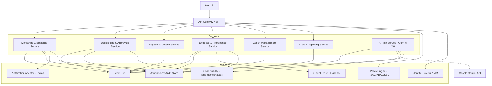
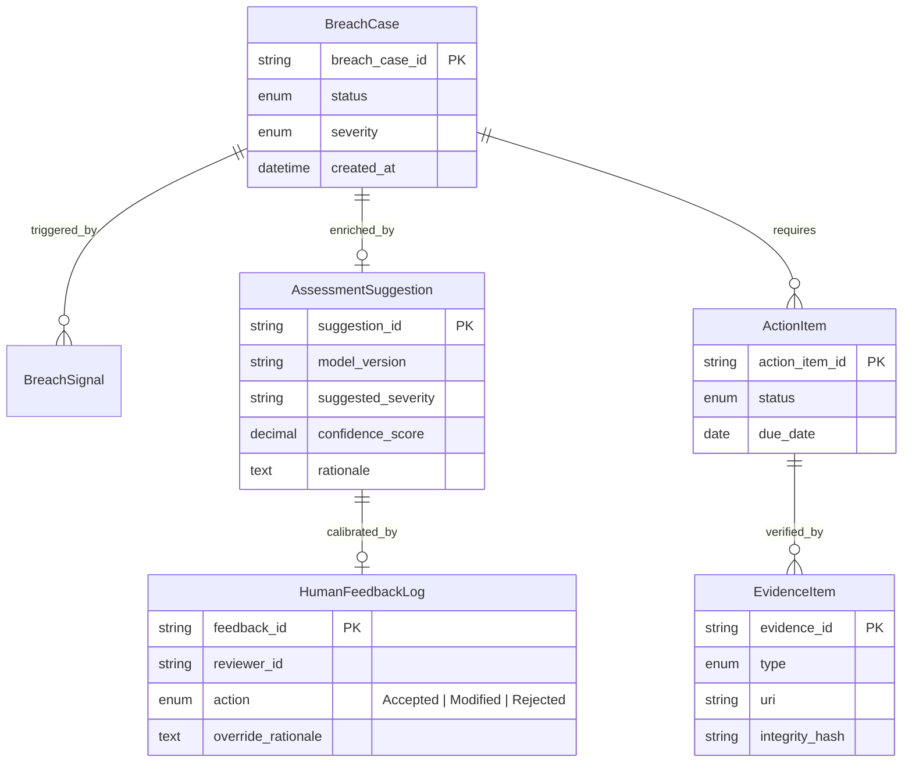

# Reference Architecture

This document provides the high-level architecture container view for the ERM platform, illustrating the interaction between domain services and platform capabilities.

## 1. Container Diagram (Runtime Topology)

## 2. Logical Information Model

This diagram illustrates the core entity relationships, emphasizing the link between breach detection, AI suggestions, and human-in-the-loop calibration.

## Architectural Components

### Domain Services
## Physical Deployment Strategy (Proof-of-Path)

For the initial "Walking Skeleton", we utilize a **Single PostgreSQL Instance** with isolated **Schemas per Bounded Context**. 

- **Monitoring Schema**: `BreachCase`, `Evaluation`
- **Decisioning Schema**: `Decision`, `Approval`
- **Audit Schema**: `AuditEvent`

This preserves logical separation and System of Record (SoR) integrity while minimizing infrastructure overhead during early build. Transition to a database-per-service model can be executed without application code changes as the platform scales.

- **Monitoring & Breaches**: Manages breach signals, triage, and breach case lifecycle.
- **Appetite & Criteria**: Owns appetite statements, versions, and threshold definitions.
- **Decisioning & Approvals**: Orchestrates the governance flow, authority checks, and decisions.
- **Evidence & Provenance**: Handles attachment indexing and integrity validation.
- **Action Management**: Tracks remediation actions and their completion status.
- **Audit & Reporting**: Aggregates append-only events for governance reporting.

### Platform Capabilities
- **Event Bus**: Decoupled asynchronous communication (e.g., Kafka, Azure Service Bus).
- **Audit Store**: Specialised immutable storage for control events.
- **Policy Engine**: Centralised enforcement for RBAC/ABAC and SoD rules.
- **Evidence Store**: Encrypted object storage for physical evidence files.
