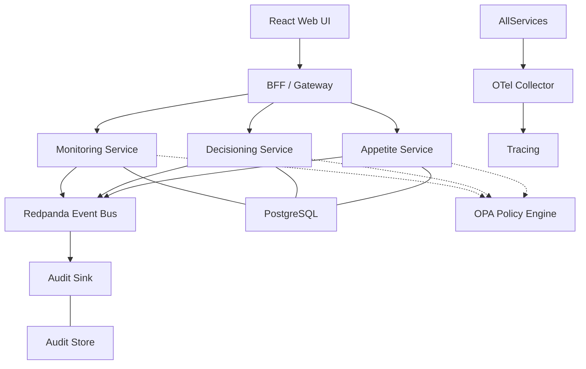

# Technology Stack & Component Architecture

This document defines the authoritative full-stack technology solution for the ERM Platform, optimized for architectural discipline, governance, and developer velocity.

## 1. Core Service Architecture
- **Language**: [TypeScript](https://www.typescriptlang.org/) (Strict Mode)
- **Framework**: [NestJS](https://nestjs.com/)
  - **Why**: Provides a modular architecture (Modules, Controllers, Providers) that enforces bounded context boundaries and supports native microservice patterns.
- **Runtime**: Node.js 20+ (LTS)

## 2. Persistence Layer
- **Database**: [PostgreSQL](https://www.postgresql.org/)
  - **Strategy**: Schema-per-context (logical isolation) in early phases, transitioning to database-per-service for full scale.
- **ORM**: [Prisma](https://www.prisma.io/)
  - **Why**: Auto-generated Type-safe client based on our `schema.prisma` definitions.

## 3. Communication & Integration
- **Event Bus**: [Redpanda](https://redpanda.com/) (Kafka-compatible)
  - **Why**: Extremely low latency, single-binary deployment for local dev, and full Kafka ecosystem compatibility.
- **Event Standard**: [CloudEvents 1.0](https://cloudevents.io/)
- **Schema Validation**: [AJV](https://ajv.js.org/) for JSON Schema (Event Payloads and API body validation).
- **API Style**: [OpenAPI 3.0](https://www.openapis.org/) (REST) for synchronous commands/queries.

## 4. Governance & Security
- **Authorization Engine**: [Open Policy Agent (OPA)](https://www.openpolicyagent.org/)
  - **Why**: Externalizes complex governance logic (SoD, Authority Matrices) as testable Rego policies.
- **Identity (Target)**: Keycloak or Auth0 (OIDC/SAML).
- **Policy Enforcement**: NestJS Guards + OPA Sidecar/Client.

## 5. Observability (OpenTelemetry)
- **Standard**: [OpenTelemetry (OTel)](https://opentelemetry.io/)
- **Trace Export**: Jaeger (Distributed Tracing).
- **Metrics**: Prometheus & Grafana.
- **Propagation**: W3C Trace Context across HTTP and Event headers.

## 6. Frontend (Proposed)
- **Framework**: [React](https://react.dev/) + [Vite](https://vitejs.dev/)
- **Language**: TypeScript
- **Styling**: [Tailwind CSS](https://tailwindcss.com/)
- **State Management**: React Query (Server state) & Zustand (UI state).

## 7. Quality & CI/CD
- **Testing**:
  - Unit/Integration: [Jest](https://jestjs.io/)
  - Contract Testing: [Pact](https://pact.io/) (Consumer-Driven Contracts)
  - E2E: Playwright
- **Linting**:
  - Code: ESLint / Prettier
  - Contracts: [Spectral](https://stoplight.io/open-source/spectral)
- **DevOps**: GitHub Actions + Docker Compose (Local) / Kubernetes (Prod).

## 🧩 Component Interaction Diagram

