# ERM Platform — System Architecture Document

> **Document type:** System Architecture Document (SAD) · C4 Container View  
> **Status:** Baseline · last updated 2026-02-24  
> **Authors:** Platform Engineering

---

## 1. Purpose

This document describes the runtime architecture of the **Enterprise Risk Management (ERM) Platform** — from the browser to every backend component. It covers technology choices, communication protocols, authentication flow, and operational infrastructure.

---

## 2. System Context

The ERM Platform is a multi-service web application deployed on a single OCI compute instance. It provides breach submission, decisioning, audit logging, and AI-assisted risk scoring for enterprise risk management workflows.

**Users** interact via a browser. **Operators** deploy via GitHub Actions CI/CD. All runtime components run as Docker containers orchestrated by `docker-compose`.

---

## 3. Container Diagram

```mermaid
%%{init: {"theme": "base", "themeVariables": {"primaryColor": "#1e293b", "primaryTextColor": "#f8fafc", "primaryBorderColor": "#334155", "lineColor": "#64748b", "secondaryColor": "#0f172a", "tertiaryColor": "#1e293b"}}}%%

graph TB

    %% ── BROWSER ──────────────────────────────────────────
    subgraph Browser["🌐 Browser — Windows Client (81.135.30.x)"]
        direction TB
        ReactApp["React 18 SPA\n──────────────\nVite 6 · TypeScript 5\nreact-router-dom v6"]
        OidcClient["OIDC Auth\n──────────────\nreact-oidc-context v3.3\noidc-client-ts v3.4\nPKCE / S256 flow"]
        DataLayer["Data & HTTP\n──────────────\n@tanstack/react-query\nAxios + Bearer token\nInterceptor"]

        ReactApp <--> OidcClient
        ReactApp <--> DataLayer
    end

    %% ── NETWORK EDGE ──────────────────────────────────────
    subgraph Edge["🔒 OCI Edge — REDACTED_IP:5180 (HTTPS)"]
        direction TB
        nginx["nginx:alpine\n──────────────\nTLS 1.2 / 1.3\nSelf-signed cert\nSAN: IP:REDACTED_IP\nPort 443 → external 5180"]

        subgraph Routing["nginx Routing Rules"]
            StaticRoute["GET /* → /dist\n(React SPA static files)"]
            KCRoute["GET /realms/* /admin/*\n→ http://keycloak:8080\nX-Forwarded-Host: REDACTED_IP:5180\nX-Forwarded-Proto: https\nX-Forwarded-Port: 5180"]
        end

        nginx --> StaticRoute
        nginx --> KCRoute
    end

    %% ── AUTH ──────────────────────────────────────────────
    subgraph AuthLayer["🔑 Identity & Access Management"]
        Keycloak["Keycloak 24.0.1\n──────────────\nRealm: erm-platform\nClient: erm-web-portal (public)\nPKCE authorization_code flow\nKC_PROXY_HEADERS=xforwarded\nKC_HOSTNAME_STRICT=false\nssl_required=NONE (DB)"]
    end

    %% ── API SERVICES ──────────────────────────────────────
    subgraph APIs["⚙️ Backend Microservices — NestJS + Prisma"]
        direction LR
        MonSvc["monitoring-service\n:4010\n──────────────\nBreach ingestion\nRisk scoring\nKafka producer"]
        DecSvc["decisioning-service\n:4011\n──────────────\nApproval workflows\nOPA policy checks\nKafka consumer"]
        AuditSvc["audit-service\n:4013\n──────────────\nEvent log\nCompliance reports\nKafka consumer"]
        NotifySvc["notification-service\n:4020\n──────────────\nEmail dispatch\nKafka consumer\nSMTP → Mailpit"]
        AISvc["erm-ai-risk-service\n:4014\n──────────────\nAI risk analysis\nML scoring engine"]
    end

    %% ── DATA ──────────────────────────────────────────────
    subgraph DataStores["🗄️ Data Layer"]
        Postgres["PostgreSQL 15\n:5432\n──────────────\nSchema: monitoring\nSchema: decisioning\nSchema: audit\nSchema: keycloak\n(Prisma ORM per service)"]
    end

    %% ── MESSAGE BUS ───────────────────────────────────────
    subgraph Messaging["📨 Event Bus"]
        Redpanda["Redpanda (Kafka-compatible)\n:29092 internal / :19092 external\n──────────────\nTopics: breach.created\nbreach.decision\naudit.event\nnotification.request"]
    end

    %% ── POLICY ────────────────────────────────────────────
    subgraph Policy["🛡️ Policy Engine"]
        OPA["Open Policy Agent\n:8181\n──────────────\nRego policies\nApproval authorization\nRole-based access control"]
    end

    %% ── OBSERVABILITY ─────────────────────────────────────
    subgraph Obs["📊 Observability Stack"]
        direction LR
        OtelCollector["OpenTelemetry Collector\n──────────────\nTraces + Metrics pipeline"]
        Jaeger["Jaeger\n:16686\nDistributed tracing"]
        Prometheus["Prometheus\n:9090\nMetrics scraping"]
        Grafana["Grafana\n:3000\nDashboards"]

        OtelCollector --> Jaeger
        OtelCollector --> Prometheus
        Prometheus --> Grafana
    end

    %% ── EXTERNAL SERVICES ─────────────────────────────────
    subgraph External["📬 External / Dev Services"]
        Mailpit["Mailpit\n:8025 UI / :1025 SMTP\nEmail capture (dev)"]
    end

    %% ── CI/CD ─────────────────────────────────────────────
    subgraph CICD["🚀 CI/CD — GitHub Actions"]
        direction LR
        Pipeline["Pipeline Stages\n──────────────\n1. Verify (lint + test)\n2. Build (native ARM64)\n3. Package (Docker push)\n4. Deploy (SSH + compose)"]
        GHCR["GitHub Container Registry\nghcr.io/domtellis/\n──────────────\nerm-portal:latest\nerm-monitoring:latest\nerm-decisioning:latest\nerm-audit:latest\nerm-notification:latest\nerm-ai-risk:latest"]
        OCI["OCI Instance\ndocker-compose.prod.yml\ndocker-compose pull + up -d\niptables firewall rules\nKeycloak SSL auto-patch"]

        Pipeline --> GHCR --> OCI
    end

    %% ── CONNECTIONS ───────────────────────────────────────
    Browser -->|"HTTPS :5180\nPKCE auth_code + code_verifier"| Edge
    KCRoute -->|"HTTP (internal)\nproxy_pass"| AuthLayer
    OidcClient -->|"Authorization Code\n+ PKCE verifier exchange"| KCRoute
    DataLayer -->|"REST API\nHTTP :4010-4014\nBearer JWT"| APIs

    MonSvc & DecSvc & AuditSvc & NotifySvc & AISvc -->|"Prisma ORM\nSQL"| DataStores
    Keycloak -->|"Realm data\nSession storage"| Postgres

    MonSvc -->|"Kafka produce"| Redpanda
    Redpanda -->|"Kafka consume"| DecSvc
    Redpanda -->|"Kafka consume"| AuditSvc
    Redpanda -->|"Kafka consume"| NotifySvc

    DecSvc -->|"Rego policy eval\nHTTP POST"| OPA

    APIs -->|"OTLP traces + metrics"| OtelCollector
    NotifySvc -->|"SMTP :1025"| Mailpit

    CICD -.->|"Deploy images on push to main"| Edge

    %% ── STYLES ────────────────────────────────────────────
    classDef browser fill:#1d4ed8,stroke:#93c5fd,color:#fff
    classDef edge fill:#064e3b,stroke:#34d399,color:#fff
    classDef auth fill:#7c3aed,stroke:#c4b5fd,color:#fff
    classDef api fill:#92400e,stroke:#fcd34d,color:#fff
    classDef data fill:#1e3a5f,stroke:#60a5fa,color:#fff
    classDef msg fill:#831843,stroke:#f9a8d4,color:#fff
    classDef policy fill:#3b1f5e,stroke:#a855f7,color:#fff
    classDef obs fill:#14532d,stroke:#86efac,color:#fff
    classDef cicd fill:#374151,stroke:#9ca3af,color:#fff

    class ReactApp,OidcClient,DataLayer browser
    class nginx,StaticRoute,KCRoute edge
    class Keycloak auth
    class MonSvc,DecSvc,AuditSvc,NotifySvc,AISvc api
    class Postgres data
    class Redpanda msg
    class OPA policy
    class OtelCollector,Jaeger,Prometheus,Grafana obs
    class Pipeline,GHCR,OCI cicd
```

---

## 4. Layer Descriptions

### 4.1 Browser (Client)

| Concern | Technology |
|---|---|
| UI framework | React 18 + TypeScript 5, bundled with Vite 6 |
| Routing | `react-router-dom` v6 — `BrowserRouter` with nested layouts |
| Authentication | `react-oidc-context` v3.3 wrapping `oidc-client-ts` v3.4 |
| Auth flow | OAuth 2.1 Authorization Code + **PKCE (S256)** — requires HTTPS for `crypto.subtle` |
| HTTP / data fetching | `@tanstack/react-query` for server state; `axios` with a Bearer-token interceptor |

The OIDC client reads the discovery document from `https://{host}:5180/realms/erm-platform/.well-known/openid-configuration`, then redirects the browser to the Keycloak login page hosted at the same HTTPS origin (via nginx proxy). After login, the authorization code is exchanged for tokens and the PKCE verifier is verified.

---

### 4.2 Edge — nginx (TLS Termination + Reverse Proxy)

nginx:alpine runs inside the portal Docker container, listening on **port 443** (mapped to external port **5180**).

| Concern | Detail |
|---|---|
| TLS | Self-signed certificate, TLS 1.2/1.3. **SAN includes `IP:REDACTED_IP`** — required by Chrome/Edge/Brave to display the cert warning rather than silently timing out |
| Static serving | `GET /*` → serves React SPA from `/usr/share/nginx/html/dist` |
| Auth proxy | `GET /realms/*`, `/admin/*` → `proxy_pass http://keycloak:8080` (internal Docker network) |
| Forwarded headers | `X-Forwarded-Proto: https`, `X-Forwarded-Host: {host}:5180`, `X-Forwarded-Port: 5180` — tells Keycloak the public URL so it builds correct `https://` issuer URLs |

> **Why proxy Keycloak through nginx?** Browsers block an HTTPS page from fetching HTTP resources (mixed content). By routing `/realms/*` through the same HTTPS nginx endpoint, all OIDC traffic stays on a single HTTPS origin.

---

### 4.3 Identity & Access Management — Keycloak

| Concern | Detail |
|---|---|
| Version | Keycloak 24.0.1 (`quay.io/keycloak/keycloak:24.0.1`) |
| Realm | `erm-platform` |
| Client | `erm-web-portal` — public client, PKCE, standard authorization code flow |
| Roles | `site_manager`, `risk_lead`, `bu_risk_owner` |
| Proxy trust | `KC_PROXY_HEADERS=xforwarded` — trusts X-Forwarded-* headers from nginx |
| Hostname | `KC_HOSTNAME_STRICT=false` — derives issuer URL from incoming request headers |
| SSL | `ssl_required=NONE` in PostgreSQL (`realm` table) — allows HTTP internally |
| Data | Realm sessions and configuration stored in the `keycloak` schema of PostgreSQL |

---

### 4.4 Backend Microservices

All services are built with **NestJS** and use **Prisma ORM** for database access. Each service owns its own PostgreSQL schema (schema-per-service isolation).

| Service | Port | Responsibility | Kafka Role |
|---|---|---|---|
| `monitoring-service` | 4010 | Breach ingestion, risk scoring | Producer |
| `decisioning-service` | 4011 | Approval workflows, OPA policy evaluation | Consumer |
| `notification-service` | 4020 | Email dispatch via SMTP | Consumer |
| `audit-service` | 4013 | Immutable event log, compliance reports | Consumer |
| `erm-ai-risk-service` | 4014 | AI/ML-assisted risk analysis | — |

All services validate incoming JWTs against Keycloak's JWKS endpoint (`http://keycloak:8080/realms/erm-platform/protocol/openid-connect/certs`) — internal network only.

---

### 4.5 Data Layer — PostgreSQL

Single PostgreSQL 15 instance with schema-level isolation:

| Schema | Owner service |
|---|---|
| `monitoring` | monitoring-service (Includes ISO 31000/45001 standards) |
| `decisioning` | decisioning-service |
| `audit` | audit-service |
| `keycloak` | Keycloak (managed internally) |

Each service connects via its own `DATABASE_URL` with a Prisma client scoped to its schema.

---

### 4.6 Event Bus — Redpanda

Redpanda provides a Kafka-compatible event bus without the ZooKeeper dependency.

| Topic | Producer | Consumers |
|---|---|---|
| `breach.created` | monitoring-service | decisioning-service, audit-service |
| `breach.decision` | decisioning-service | audit-service, notification-service |
| `audit.event` | all services | audit-service |
| `notification.request` | decisioning-service | notification-service |

---

### 4.7 Policy Engine — OPA

Open Policy Agent evaluates **Rego policies** for approval authorization. The `decisioning-service` calls OPA via HTTP POST before allowing any breach approval, enforcing role-based access and four-eyes principles.

---

### 4.8 Observability

| OpenTelemetry Collector | Receives OTLP traces and metrics from all NestJS services |
| Jaeger (`:16686`) | Distributed trace visualization |
| Prometheus (`:9090`) | Time-series metrics storage (**Pinned v2.54.1 for stability**) |
| Blackbox Exporter (`:9115`) | Active health checking via `/api` (Swagger UI) probes |
| Grafana (`:3000`) | Unified dashboards, including **AI TRiSM (2026)** framework |

---

### 4.9 CI/CD Pipeline

GitHub Actions on every push to `main`:

1. **Verify** — lint, type-check, unit tests
2. **Build** — compiles TypeScript natively on the runner (ARM64) — avoids slow QEMU emulation
3. **Package** — builds Docker images and pushes to GHCR (`ghcr.io/domtellis/*`)
4. **Deploy** — SSH into OCI, `docker-compose pull && docker-compose up -d`, then automatically patches Keycloak SSL setting via `psql`

---

## 5. Key Design Decisions

| Decision | Rationale |
|---|---|
| HTTPS on portal only (no full mTLS) | Pragmatic for single-instance OCI deployment; reduces certificate management overhead |
| nginx proxies Keycloak | Eliminates mixed-content browser blocking without requiring Keycloak to handle TLS |
| `KC_PROXY_HEADERS=xforwarded` | Allows Keycloak to build correct `https://` issuer URLs when behind nginx without hardcoding hostnames |
| Schema-per-service (not DB-per-service) | Simpler single-instance PostgreSQL operation while maintaining service data isolation |
| Redpanda over Apache Kafka | No ZooKeeper dependency; drop-in Kafka protocol compatibility; simpler single-binary deployment |
| Native ARM64 build in CI | Eliminates QEMU emulation during Docker build — 10–15× faster build times |

---

## 6. Ports Reference

| Port | Service | External access |
|---|---|---|
| `5180` | Portal (nginx HTTPS) | ✅ Public |
| `8080` | Keycloak (HTTP) | ✅ Public (admin) |
| `4010–4014, 4020` | Backend APIs | ✅ Public (REST/Swagger) |
| `16686` | Jaeger | ✅ Public |
| `3000` | Grafana | ✅ Public |
| `8025` | Mailpit UI | ✅ Public |
| `5432` | PostgreSQL | ❌ Internal only |
| `29092` | Redpanda (Kafka) | ❌ Internal only |
| `8181` | OPA | ❌ Internal only |

---

## 7. Related Documents

- `infra/local/docker-compose.prod.yml` — full service definitions
- `infra/local/keycloak/realm-export.json` — Keycloak realm configuration
- `.github/workflows/ci.yml` — CI/CD pipeline definition
