# Screen Index — SB-01 Prototype

## Screen Manifest

| # | Screen ID | Screen Name | Feature | Story | Purpose |
|:--|:----------|:------------|:--------|:------|:--------|
| 1 | `home` | Home / My Work | - | - | Dashboard: assigned cases, pending approvals, overdue actions |
| 2 | `breaches-list` | Breaches List | F-01-01 | S-01, S-02 | Filter and view breach cases |
| 3 | `case-detail` | Breach Case Detail | F-01-02 | S-03 | Case overview with timeline and status |
| 4 | `triage` | Triage Form | F-01-03 | S-04 | Capture severity, location, impact |
| 5 | `eval-step1` | Evaluation Step 1 | F-02-01 | S-05 | Select appetite statement and threshold |
| 6 | `eval-step2` | Evaluation Step 2 | F-02-02 | S-06 | Enter measured value and rationale |
| 7 | `escalation` | Escalation View | F-03-01 | S-07 | Auto-escalation notification and explanation |
| 8 | `decision-submit` | Decision Submission | F-03-02 | S-08 | Submit decision with rationale |
| 9 | `decision-ask` | Decision Ask | F-03-03 | S-09 | BU Risk Owner approval screen |
| 10 | `evidence` | Evidence Library | F-04-01, F-04-02 | S-10, S-11 | Evidence list with upload and gating |
| 11 | `action-plan` | Action Plan | F-04-03 | S-12 | Action items with tracking |
| 12 | `close-case` | Close Case | F-04-04 | S-13 | Closure modal with validation |
| 13 | `audit-pack` | Audit Pack Export | F-05-02 | S-15 | Export preview and download |

## Navigation Flow

```mermaid
flowchart LR
    home --> breaches-list
    breaches-list --> case-detail
    case-detail --> triage
    triage --> eval-step1
    eval-step1 --> eval-step2
    eval-step2 --> escalation
    escalation --> decision-submit
    decision-submit --> decision-ask
    decision-ask --> action-plan
    action-plan --> evidence
    evidence --> close-case
    close-case --> audit-pack
```

## Traceability

Each screen maps to:
- **Feature ID** (F-xx-xx): from `features.yaml`
- **Story ID** (S-xx): from `stories.yaml`

This ensures prototype validation directly informs backlog acceptance criteria.
