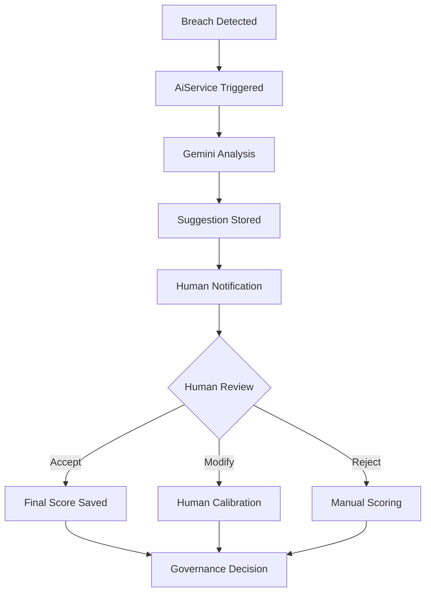
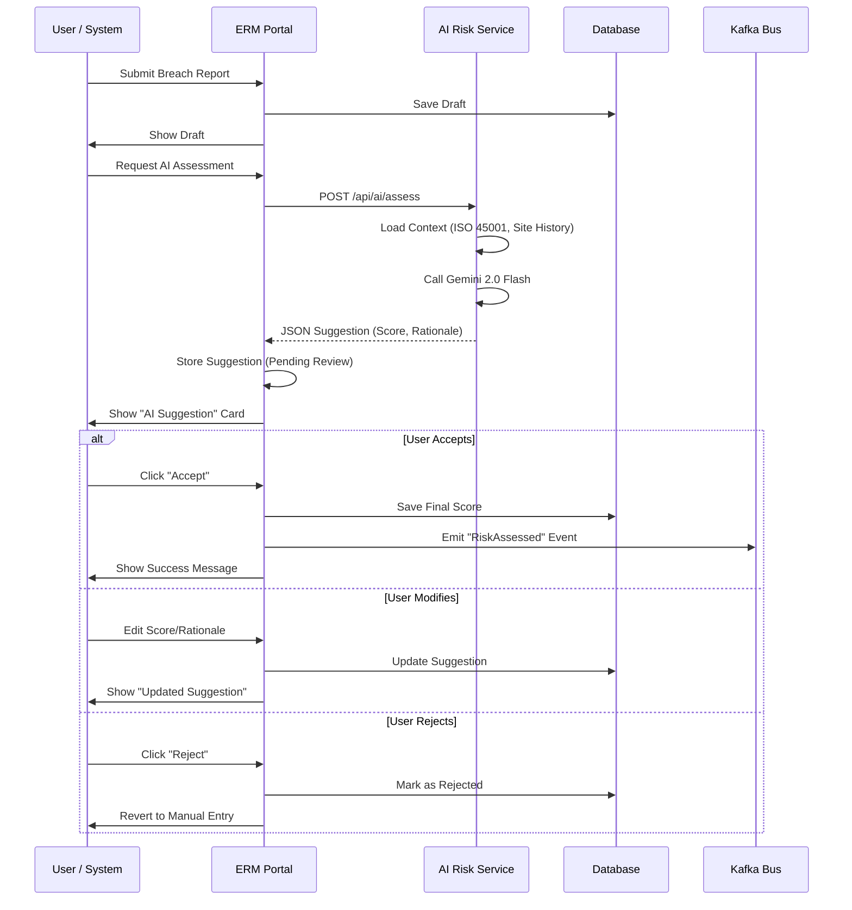

# AI Risk Assessment Workflow — SB-02

This document defines the end-to-end operational workflow for AI-assisted risk assessments within the ERM Platform.

## 1. Process Overview
The workflow ensures that every appetite breach is analyzed by a vetted AI model against ISO 45001 standards, with mandatory human verification before any governance decision is finalized.

## 2. Roles & Responsibilities

| Role | Responsibility |
| :--- | :--- |
| **System Agent** | Monitor Gemini API health, token usage, and Kafka outbox processing. |
| **Risk Analyst** | Perform primary review of AI suggestions; calibrate scores based on local context. |
| **BU Risk Owner** | Approve high-severity assessments; ensure AI recommendations are implemented. |

## 3. SLA & Quality Targets
- **AI Turnaround**: < 5 seconds from breach detection to suggestion availability.
- **Human Review**: Mandatory within 24 hours for High/Critical breaches.
- **Accuracy Target**: > 85% human acceptance rate (Initial target: 65%).

## 4. Model Context (Prompt Engineering)
The `AiService` embeds the following context in every request:
- ISO 45001 Clause mapping.
- Historical breach context for the specific site.
- Current Risk Appetite thresholds.

## 5. Escalation Path
If the AI service is unavailable (e.g., API quota exceeded or network failure):
1.  System alerts **Risk Lead** via internal dashboard.
3.  "AI Service Down" banner is displayed on the Decisioning Page.

## 6. Monitoring & TRiSM Visibility
The AI assessment pipeline is instrumented for **AI TRiSM (2026 Standards)**. 
- **Dashboard**: [AI Risk Assessment Performance](https://erm.prod:5180/grafana/d/ai-risk-performance/)
- **Golden Signals**: Real-time tracking of token cost, safety blocks, and human agreement rates.
- **Bootstrapping**: Metrics are initialized to `0` on service startup via `OnModuleInit` to ensure continuous visibility even during low-traffic periods.
