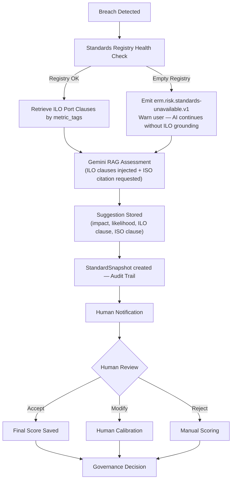
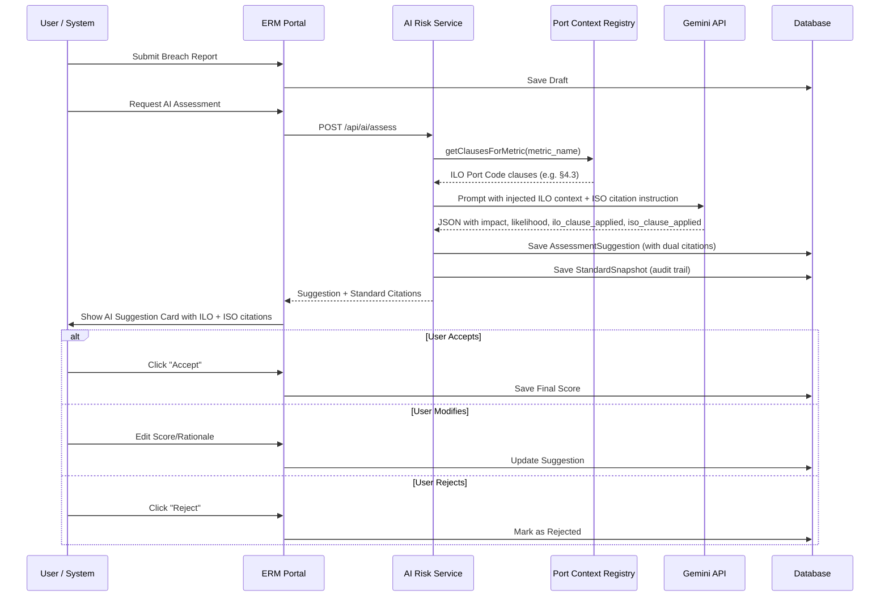

# AI Risk Assessment Workflow — SB-02

This document defines the end-to-end operational workflow for AI-assisted risk assessments within the ERM Platform using the **S-AIR (Standards-Aware AI Risk)** architecture.

## 1. Process Overview

Every appetite breach is analysed by a RAG-grounded AI model, with assessments explicitly anchored to ILO Port Code clauses (Option B) and ISO 45001/31000 (Option A — Gemini's pre-trained knowledge). Mandatory human verification is required before any governance decision is finalised.

## 2. Standards Grounding (S-AIR)

Every AI assessment must include:

| Field | Source | Example |
|---|---|---|
| `ilo_clause_applied` | Port Context Registry (ILO Port Code) | `ILO-PORT-2018 §4.3` |
| `ilo_clause_title` | Port Context Registry | `Crane and Lifting Equipment Safety` |
| `iso_clause_applied` | Gemini pre-trained knowledge | `ISO 45001:2018 Clause 6.1.2` |
| `iso_clause_title` | Gemini pre-trained knowledge | `Hazard identification and risk assessment` |
| `unable_to_cite_reason` | Set if AI cannot determine clause | Shown explicitly to Risk Analyst |

## 3. Roles & Responsibilities

| Role | Responsibility |
| :--- | :--- |
| **System Agent** | Monitor Gemini API health, token usage, Kafka outbox, and Standards Registry health. |
| **Compliance Team** | Maintain ILO clause seed data; validate summaries annually. |
| **Risk Analyst** | Review AI suggestion and citation; flag if standard citation appears incorrect. |
| **BU Risk Owner** | Approve high-severity assessments. |

## 4. SLA & Quality Targets
- **AI Turnaround**: < 5 seconds from breach detection to suggestion availability.
- **Human Review**: Mandatory within 24 hours for High/Critical breaches.
- **Accuracy Target**: > 85% human acceptance rate (Initial target: 65%).
- **Citation Rate**: > 95% of assessments must include a valid `iso_clause_applied`.

## 5. Standards Sync & Out-of-Sync Handling

If the `SyncEngine` detects the ILO publication has changed:
1. `SyncLog.status` is set to `"stale"`.
2. A Kafka event `erm.standards.out-of-sync.v1` is emitted.
3. The UI displays: *"Port safety standards may need review. Last verified: [date]."*
4. The Compliance team must review the ILO publication and re-run the ingestion guide.

See: [Standards Ingestion Guide](../guides/standards-ingestion-guide.md)

## 6. Escalation Path

If the AI service or Standards Registry is unavailable:
1. System emits `erm.risk.standards-unavailable.v1` event.
2. "AI Service Notice" banner is displayed on the Decisioning Page.
3. Risk Lead is alerted via internal dashboard.

## 7. Monitoring & TRiSM Visibility
- **Dashboard**: [AI Risk Assessment Performance](https://erm.prod:5180/grafana/d/ai-risk-performance/)
- **Golden Signals**: Token cost, citation rate, safety blocks, human agreement rates.
- **New Metric**: `standards_registry_active_clauses` — drops to 0 if registry is empty.
