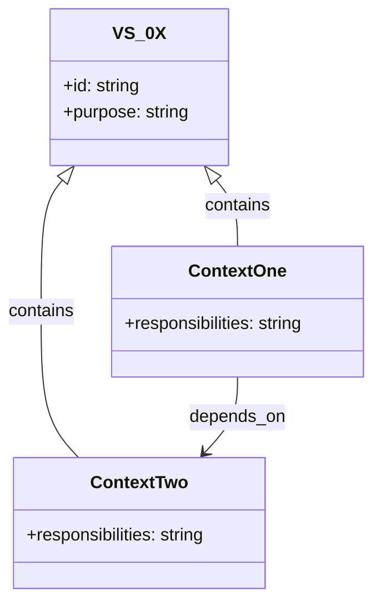

# VS-0X — <Name>

## Customers / stakeholders
- …

## Purpose (value)
- …

## Triggers
- …

## Inputs
- …

## Entry criteria / DoR
- …

## Key activities
1. …
2. …

## Decisions & stage gates
- D1 …
- D2 …
- D3 …

## Outputs
- …

## Exit criteria / DoD
- …

## Metrics
**Flow:** …
**Performance:** …
**Risk:** …

## Bounded contexts
- BC-1: <Name> — short description of responsibilities
- BC-2: <Name> — short description of responsibilities

> **Tip:** Add a `bounded_contexts` list in the YAML front-matter (see example below) so the generator can create `conceptual.mmd` classes automatically.

## Mermaid conceptual diagram (class diagram)
Use a Mermaid `classDiagram` to model the value stream and its bounded contexts. Add a `mermaid` fenced code block to your document if you want fine-grained control. The generator will create a default skeleton if none is present.

Example front-matter additions:
```yaml
bounded_contexts:
  - id: BC-1
    name: "Context One"
    description: "What this context is responsible for"
  - id: BC-2
    name: "Context Two"
    description: "What this context is responsible for"
```

Example Mermaid skeleton the generator produces (or you can include in your .md):


